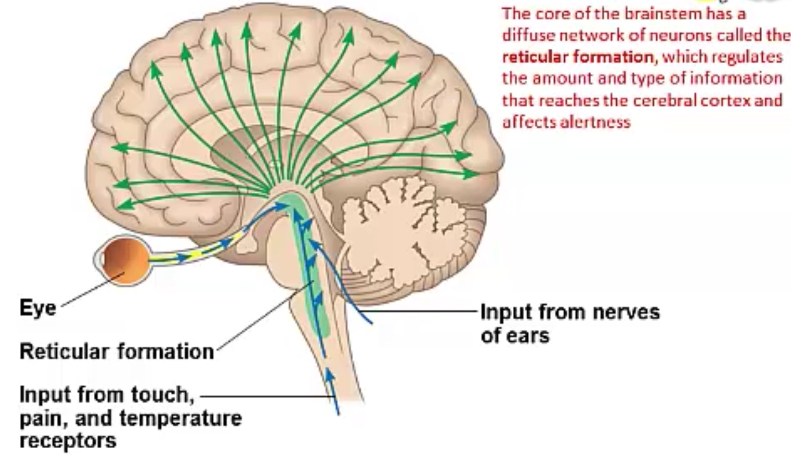

# Neuroscience

## anatomical structure
1. CNS: spinal cord, medulla, pons, midbrain, cerebellum, diencephalon, cerebrum
2. Cerebrum: cerebral cortex, basal ganglia, hippocampus, amygdala
3. PNS: somatic, autonomic systems (sympathetic, parasympathetic, enteric divisions)

## Function

### Spinal cord

Brain stem(medulla, pons, midbrain)
Medulla: vital autonomic functions
Pons:relays info about movement from cerebral cortex to cerebellum
Midbrain:sensory & motor functions. (eye mov.)

