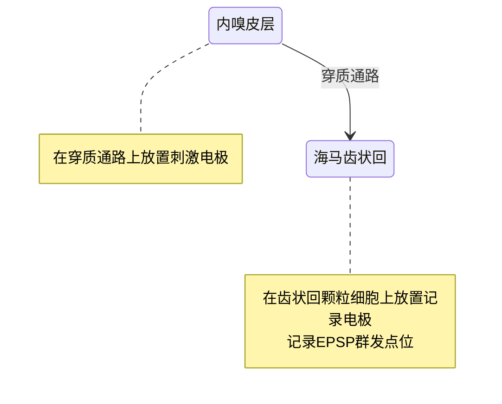

# 神经科学

[TOC]

# 社会行为中的认知神经科学

[英]A. Easton & M. J. Emery

## 1 社会-情绪认知神经生物学

社会交互的神经机制，社会认知缺陷

## 2 非人类灵长类动物

Kluver-Bucy综合征：口部过度活动、思维奔逸、情绪反应缺失、饮食习惯改变、异常性行为和视觉失认症/精神性盲(hyperorality, placidity, hypermetamorphosis, dietary changes, altered sexual behavior, and visual agnosia)

Rosvold-Mirsky-Pribram1954：恒河猴社群-脑组织损毁-实验

### Amyg-社会认知
Amyg切除 -> 侵略性和社会地位下降；社会退缩（对同类善意信息不予反应；退出社会活动）-> 死亡 (Kling)

Kling & Mass(1974): 单独关在笼子里表现出LB-syn，在群居环境中未显示（社交效应）

### OFC-社会情绪认知
OFC损伤 -> 侵略性提高 -> 逐渐丧失主导地位

额叶切除 -> 减少社会关系的行为

### 与人类相关性

Amyg-社会抑制

Adolphs-Tranel-Damasio1998陌生人面孔-信任度判断-实验

OFC-情绪改变、决策障碍、自主反应/消极反应预期能力改变

社会规则故事 -> lOFC

## 3 行为灵活性

### 行为灵活性

定义：根据社会情境做出行为调整的能力

*压力荷尔蒙会抑制学习*（Lupien & Lepage 2011）

Drea & Wallen, 1999: “假装愚钝”实验，在一个上下级关系中，地位低的猴子比地位高的猴子学习速度慢。

### 杏仁核(Amyg)的作用

Amyg：对象与“内在”奖赏价值联结起来（Gaffan1992）

OFC：奖赏的价值的变化

Rolls 1982, 强化物贬值实验：

- 过程：
   1. 确定猴子的食物偏好，如花生>水果
   2. 降低食物激励价值（动机水平），摄取花生，直到吃腻（餍足）
   3. 再次选择食物

- 发现：
  杏仁核兴奋毒性损毁的猴子不会改变选择

行为调整的能力在社会交互中是必要的，因为刺激本身的价值并不足以确定适当的行为，行为应该反映特定社会情境下刺激的价值。

### 眶额叶皮层(OFC)的作用

Rolls 1994: 奖赏条件翻转实验

交叉单侧分离技术：Amyg-OFC异侧交互

```
C.S, Amyg, M.Dop, Hip(memory) -> OFC
```

根据奖赏结果的改变来调整自己的反应模式恰恰是前面所提到的正常社会交往中所需要的行为灵活性的一种表现。

`Amyg <--> OFC` 在行为灵活性的产生中起到至关重要的作用，在奖赏价值转变时改变行为模式。

|年份|研究人员|实验|结论|
|---|---|---|---|
|1996|Critchley & Rolls|-|OFC细胞对于变化的奖赏价值发生了明显的反应改变|
|1999|Tremblay & Schultz|空间延迟反应任务|OFC对奖励的当前激励价值，而非奖赏的绝对价值做出反应的过程中起到了重要作用|

**反应活性-价值原理** 神经元反应活性是奖赏的价值的递增函数
`x = g(v) where g: increasing`

### 前额叶与颞下皮层交互(FPC-ITC)

ITC: 表征复杂对象

目标-奖赏联结学习

存在两侧半球之间的交互，通过基底前脑交互（Easton 2002...）

Trapold(1970)条件辨别任务

Calson-Wielkiewicz(1972)双条件辨别任务

是否需要行为灵活性（而不单纯是任务难度）决定了同侧半球内前额叶和颞下皮层是否发生交互作用。

PFC决定当前恰当选择

## 5 社会认知的进化

### 心理理论/读心/元表征

理解他人心理状态的能力，比如理解他人的信念、愿望和知识等

Dennett/Whiten *意向立场*，*中介变量*

0-3L 意向水平；心理状态：行为原因->结果

Premack1988: 知觉性的（理解他人的观察/注意）、动机性的（欲望/目标/意图）、信息性的（知识/信念）

#### 知觉性心理理论

##### 注意

Tomasello1999: 黑猩猩-目标物/分心物注意实验：黑猩猩能进行注意追踪

社会教化

目标-选择范式

##### 观点采择

战术欺骗

Kummer-Anzenberger-Hemelrijk1996: 猕猴-果汁获取-人类视线理解实验

##### 意图交流

Theall-Povinelli1999: 黑猩猩🦍-人类眼睛状态-注意获取实验。

黑猩猩不能理解眼睛与看的关系

视线交替：信息发送者会持续与信息接受者进行交流直到交流目标达成或信息接受者离开。

### 错误信念

Gomez1998: 错误信念实验

1. 训练期：雌性红毛猩猩X被置于笼子，笼子前有锁住的盒子，其中一个有食物，钥匙在容器中。管理者训练X指向有食物的盒子。
2. 测试期1：给予者问食物的位置。
3. 测试期2：提供者藏钥匙后，给予者问食物的位置。

Whiten: 黑猩猩错误信念实验：没有错误信念归因

### 模拟理论：角色采择（认知共情）/经验投射

Mason, Hollis 1962: 观察者-操作者-实验范式

Emery&Clayton2001: 西部灌丛鸦护食实验。偷窃行为的乌鸦对观察者经验投射

## 6 社会认知功能解剖学

### 社会认知

**定义**

精确感知他人性情和意图的信息加工过程。（Brothers1990）

纹外视觉皮层：生命性/社会性线索感知

梭状回：面孔识别

颞上沟：身体运动（眼睛注视、眼睛运动、嘴巴动作、含动态意向的图片）；目标指向性运动

颞上沟后部：心理状态归因

### 情绪识别

基本情绪：愤怒:angry:、厌恶、恐惧、快乐、悲伤、惊讶:astonished:

Amyg、OFC、右侧躯体感觉皮层，左侧额叶岛盖

Canli...2002: 外倾性个体-快乐脸/恐惧脸-杏仁核-激活实验

### 人格特质归因

杏仁核——面孔种族性自动/无意识分类

前额叶——压抑/调节反应

### 信念归因

Premack-Woodruff(1978): ToM

Sally-Anna task

#### OFC, Amyg

Damasio: 获得性反社会人格: OFC损伤 => 不能利用社会线索与情绪线索正常地指引自己的行为。

#### 社会认知任务

VMF受损=>非社会规则下符合逻辑的正确选择+，社会规则下-

## 7 自我与社会知觉

颞上沟（回）与有意图的行为识别有关

对应偏见/基本归因偏差（Jones, Davis 1965）

### 自我

- 自我认识：认识自己，存储关于自己的个性、偏好与经历的信息的能力；观点采择
   - 基于证据的自我认识：经验较少领域；海马、楔前叶、外侧PFC
   - 基于直觉的自我认识：熟知领域；vmPFC，伏核，Amyg，楔前叶
- 自我意识：识别和反思自己当前的体验和行动的能力；引起自我意识的冲突事件 => **前扣带回** => 自我意识体验；后顶叶皮层 => 病感失认症（对自身障碍进行扭曲的合理化）
- 自我控制：战略上克服自己的冲动和习惯的自我调整能力；
   - 外侧PFC，基底神经节；帕金森病、亨廷顿舞蹈症、强迫症、抽动秽语综合征 (Lakoff & Johnson1999; Turner1976; Lieberman2000)
   - PFC类似肌肉的特性（Vohs & Heatherton2000）
   - PFC
      - PFC直接激活运动系统，使个体远离偏自动化的神经过程的控制
      - 促进弱加工过程/表征，与自动化过程/表征竞争
      - 抑制不确定的冲动/表征

试图抑制占优势的行为/强烈的情绪反应会激活vmPFC。

“Ochsner图像重新评估实验”

当一个事件对一个人的意义发生变化时，那么相应的情感也会发生变化。

Liebeman: 服用安慰剂之后前扣带回激活减少 ~ 右腹外侧PFC

### 社会知觉

自我种族偏见

### 归因

人类独有的，理解他人意图、信念、欲望和稳定的心理特质的能力。

对应偏见/基本归因偏差(Ross1977)

#### 神经关联

"Heider-Simmel好斗三角形视频意图知觉实验"

双侧颞上沟、右侧颞机、Amyg、梭状回、vmPFC

#### 神经认知

Gilbert序列操作模型（1989）：行为分类、性格表征、校正

第三阶段比前两个阶段需要更多的认知资源和动力资源。

## 9 单向抑郁症 uMDD

### 发展

前青春期：环境（虐待、社会因素、营养缺乏）==> 调节情绪环路

Amyg，Hip: GC持续或间歇升高 -> GC受体容易受到其他毒素的影响导致功能萎缩和衰竭。

青春期：GC升高~单相抑郁

神经脆弱程度提高 -> HPA轴激活，血液中性激素在外周神经和大脑增加；大脑DHEA ~ 对压力（感染、逆境、残疾）的敏感度

### 抑郁认知理论

#### 负性认知模式

A. Beck(1967,1976): 单相抑郁特征：对自己和他人的经历有明显消极的看法。

三重消极认知：自我、世界、未来

消极想法 -> 情绪低落 -> 消极想法（负性认知模式） -> cycle

#### 习得性无助

Seligman1975: 抑郁=预期未来无助状态的结果
- 动机障碍
- 认知障碍
- 情感障碍

归因维度(Abramson1978)：
1. 内部-外部：原因归于个体/坏境（他人）
2. 稳定-不稳定：原因是永久/短暂
3. 全局-特殊：原因广泛/在特殊情况下造成失败

单相抑郁消极事件归因：内部-稳定-全局

Bower1981，情感-记忆关联网络理论

消极情感-认知循环 --> 临床抑郁

Teasdale1983, 1988 差异性激活假设

### 社会认知

Drevets2000, 抑郁个体对负性情绪记忆的反刍。dlPFC -, Amyg +

vmPFC新陈代谢+ ~ D程度；
喙侧前扣带回 + ~ 抑郁回复

Rajkowska1999抑郁患者尸检：皮层厚度、神经元大小、神经元胶质细胞密度- => OF损伤 => D

### 执行功能

兴趣唤醒、目的性行为、奖赏获取

Duncan1986: 精神加工过程、外显行为活动

1. 形成关于期待的目标或活动结果的意识
2. 采取有策略的行动计划来达到这一目的
3. 抑制/延缓不当的行为反应以便做出做合适的行为动作

Pennington & Ozonoff1996: 环境特定性动作选择
Tamminga2000: 执行能力 = {注意力、计划、决策、抑制、记忆}

#### 决策

决策过程的核心可能取决于注意和工作记忆资源，以及能影响决策中情绪和情感的富含情绪属性的刺激内容。

Damasio1994: 躯体标记假设

vmPFC: 情绪体验核心区域

Scheonbaum1998: OFC~ 目标导向行为的信息编码：依靠有限的背景信息做决策时，OFC的作用尤为重要，
`OFC<->边缘系统 -> 最优决策`
诱发强化动机

OFC损坏 -> 感觉刺激-情感反应障碍，自我行为、人格变化、社交障碍、日常决策障碍（Stuss & Benson1986）
vmPFC 损坏 -> 无法启动、组织、执行正常行为，自主性减少，优柔寡断，人际关系破裂、财务困难、固着行为（Anderson, Damasio...1992）

Kyte2004: 青少年-赌注-决策实验；青少年在下降条件下往往下更高额的赌注，...更加冲动。

Corruble1999：冲动性是临床抑郁症非常重要的一个表现。

#### 抑制

抑制假设：行为抑制障碍可以被看作PFC的抑制机制在抑制由当前环境中的线索所诱发的不恰当行为时出现的障碍。...妨碍对长远目标控制的、可供选择的、更加合适的行为计划的挑选，使得行为完全由当前对环境的感性评估所决定。其结果是反应仅仅建立在相关情绪的体验上，且行为不受社会规则的约束。

OFC损伤病人：不能进行行为抑制，冲动，注意集中度不够，注意过程存在偏向

OFC/vmPFC损伤：在刺激的情绪意义发生变化时，个体相应地改变行为的能力受损；外侧PFC受损：注意选择困难（注意在特征之间的高阶转移）

抑郁成年患者：外侧PFC-情绪性（悲伤）刺激；vmPFC/OFC-情绪情境中行为抑制起作用/对抑郁的存在敏感

### 社会应对/逆境反应

Kyte框架：

1. 构架阶段：选择性注意/持续性注意+行为抑制
2. 执行阶段：选择+行动
3. 维持阶段：结果

执行过程损伤：

- 形成行为刚性（固着）
- 注意力极度分散
- 难以维持目标导向行为
- 妨碍选择最优的或备选的行动计划
- 损害注意力和反应之间的转化
- 决策欠佳
- 减少适应性应对的机会

社会应对：

- 社会特征：
  - 将事件感知为不好
  - 情绪低落，过度关注自我
- 认知特征：
  - 问题解决能力存在障碍
  - 认为自己没有效率
  - 脱离环境控制
- 执行特征：难以决断

## 10 反社会行为&精神变态

*关键词* 反应性攻击、工具性攻击、道德性/习俗性反社会行为

<dl>
  <dt>反应性（情感性）攻击</dt>
  <dd>一个让人产生挫折感的事件或者有威胁性的事件诱发了攻击行为（愤怒情绪）；不考虑潜在的目标</dd>
  <dt>工具性（主动性）攻击</dt>
  <dd>为了实现特定的期望目标（获得财务，提高团体里的地位）；有目的和目标指向</dd>
  <dt>违反习俗</dt>
  <dd>不会导致对他人的伤害，但会扰乱社会秩序，打破行为预期</dd>
  <dt>违反道德</dt>
  <dd>伤害他人</dd>
</dl>

| 类型  | 行为             | 神经科学                     |
| --- | -------------- | ------------------------ |
| 工具性 | 违反道德；缺少共情和内疚   | 颞叶皮层、纹状体、前运动皮层           |
| 反应性 | 违反习俗；对传统规则漠不惯性 | 眶额叶皮层、内侧额叶皮层（调节皮下威胁应对系统） |

精神变态筛选：

- Antisocial process screening device (Frick & Hare 2001)
- Psychopathy checklist: youth version (Forth, Kosson & Hare 2002)
- Psychopathy checklist-revised (Hare 1991)

### 反应性

Amyg x => 妨碍反应性攻击的抑制，增加攻击概率；
厌恶/满欲 -> 攻击增加/减少

Goyer1994: 反应性攻击病人额叶功能降低

OFC: RR/SRR

外侧OFC: 调节个体的社会行为，特别是能够根据个体交互对象的主导性社会地位来调节。OFC损伤 => 攻击不会考虑到他人的社会地位

*注* 挫折-反应性攻击（Berkowitz1993）：想要获得期望的奖赏但未能如愿。愤怒😡：为了在社会传统规则遭到破坏或期望被违背的情境中限制其他个体的行为。（Averill1982）尴尬：缓和、补救

### 工具性

Passingham & Toni2001

- 颞叶皮层：表征物体
- 纹状体+前运动皮层：负责实际行为

### 额叶功能障碍假说

vmPFC, OFC ~ （反应性）攻击行为；dlPFC没有参与，但相关

vmPFC, OFC功能障碍 -> 反应逆转受损 -> 反应性攻击+

### 反应集调节假说（Newman1998）

精神变态者的冲动性、更差的被动回避以及情绪处理缺陷，也许可以理解为不能够对有意注意焦点的外围或者偶然信息的意义进行自动化加工。(Lorenz & Newman2002)

被动回避学习：电脑化的数字任务（Newman & Kosson 1986）

一包纸牌任务（Newman, Patterson  & Kosson 1986）

偏向竞争模型（Desimone & Duncan 1995）

精神变态个体自下而上的感觉驱动机制的作用减少。

任务负荷（Lavie1995）

反应逆转范式

### 恐惧功能失调假说

- ACS的形成（Flor, Birbaumer, Hermann, Ziegler, & Patrick2002, Lykken1957）
- 可对预期的威胁产生自动化的反应(Hare1982, Ogloff & Wong1990)
- 对视觉威胁启动刺激的惊跳反应增强(Herpertz2001, Levenston, Patrick, Bradley & Lang2000)
- 被动回避学习(Lykken1957, Newman & Kosson 1986)
- 反应逆转(Mitchell2002, Newman1987)

较高的威胁/挫折 => 反应性攻击（Blanchard1977）
焦虑 ~ 反社会行为（麻木-、无动于衷-、冲动+、品行障碍+）

BIS(Gray1987...)

Killcross1997：ACR,OCR双重分离

Amyg中央核 --- ACR; 基底核 --- OCR

Hoffman1984: 道德社会化不会通过FC的建立获得，而是需要通过诱导和培养共情获得的。

### 暴力抑制机制

悲伤 => 自主神经活动增加、注意力加强，激活脑干威胁反应系统。

精神变态个体表现出应对他人悲伤/恐惧的自动化神经活动减少（Aniskiewicz1979, Blair1997...）

### 整合性情绪系统模型

精神变态个体: Amyg体积(-)，ACS任务中，反应(-)

Amyg: S~S+, S~S-

Amyg x => 形成ACR的能力受损

Hamann & Mao2002：厌恶性词语CS实验

OFC-反应逆转作用 = f(不匹配程度(预期强化（Amyg->OFC）, 实际强化(伤害输入)))

Amyg-OFC失调 ->（社会）反应逆转负性影响 -> 难识别偶然性变化

*反应逆转* 根据一个偶然变化的函数而改变对某一S的R；学习抑制那些原本会受到奖赏但现在却会受到惩罚的R。（Rolls1997）

*被动回避* 对一些S进行R，对一些不R。


精神变态 ~ 对偶然变化的检测能力x，成人更为明显

---


# 人类发展的认知神经科学

[英]M D Haan, M H Johnson

## 8 情绪、认知、HPA轴

### HPA神经生物学

LHPA: HPA通过边缘系统对心理应激源产生反应；边缘系统对HPA的调控非常重要

虐待，切断母婴关系，不幸的童年 => 较高GC水平，LHPA失调；害羞，支配性低，对新异性的恐惧

### LHPA与发展

儿童

调节注意 - 引发恐惧的刺激的敏感性

群体融入，情感 - GC反应性

反馈机制：高水平GC与产生CRH的神经元（杏仁核）表面受体结合，导致杏仁核过度敏感，发生焦虑障碍

性虐待女孩-ACTH水平低，GC基线水平高

### 认知与LHPA

GC水平极度高/低的情况下会抑制长时增强，而中等程度的GC会促进长时增强。持续或极度的GC水平升高会导致海马神经的退行性改变


---

# 生理心理学

记号：

-> 影响，导致，神经连接

=> 产生，因果关系

`>>`移动

`~` 相关、伴随

s: 刺激、信号

B: 行为

H: 激素

## 情绪

前额叶在识别复杂社会情境的情绪意义并据此调节个人行为的过程中起到了重要的作用。

腹侧前额叶皮层：内侧眶额皮层、膝下前扣带皮层。

### 情绪反应

#### 恐惧

情绪：行为B, 自主神经VNS，激素H

每个成分由相对独立的NS控制，恐惧情绪成分整合由Amyg控制。

Amyg: LA, 基底核，CE

信号传导（大致路线） s -> LA -> 基底核 -> CE -> 情绪表达

条件情绪反应：曾与情绪刺激配对的中性刺激诱发出的反应

抑制由vmPFC完成；vmPFC影响CER消退，调节不同情境下恐惧的表达

vmPFC受伤会造成严重损害，常使人的行为控制与决策能力受损。这些表现似乎是情绪调节异常的结果。

#### 愤怒，攻击

（前脑）5-羟色胺能突触的活动会抑制攻击（Vergnes 1988）

### 情绪交流

#### 先天反应

#### 识别

当人们处于一个互动的社会坏境中时，他们会露出更多笑容。

Kraut(1979): 当人们独处的时候，愉快的事件和情境只能使他们流露出少许快乐的征象；当人们处于一个互动的社会坏境中时，他们会露出更多笑容。

Meeren(2005): 面部表情感知不仅受表情本身影响，也会受到肢体语言的影响

## 学习与记忆

学习形式：

1. 知觉学习：识别、分类
2. S-R学习：CC, IC
3. 运动性学习：行为越新异，运动神经回路的改变越大
4. 关系性学习：刺激关联，情景学习（记住我们所目睹事件的发生序列）

ALTP: 单个神经元的弱突触和强突触在几乎同一时间内兴奋，那么弱突触会得到加强。

### 突触可塑性

#### LTP



LTP: 刺激电极在几秒之内产生充分多的电脉冲引发LTP，记录电极反应的大小比之前大。

#### NMDA 受体: 神经递质（谷氨酸）+电压（Ca2+）依赖性离子通道

LTP:

1. 去极化（解除Mg2+离子）
2. 刺激轴突（谷氨酸）
3. 突触增强
    - Ca2+进入（NMDA受体通道）
    - CaM-KII（Ca2+依赖性酶）激活
    - AMPA受体：树突相邻的非突触区域 >> 突触后膜

钙离子...通过有NMDA受体控制的离子通道进入细胞是LTP中最关键的一步。

#### 突触可塑性机制

ALTP:

去极化：强突触的活动足以引发神经元的动作电位 => 树突棘的膜就会去极化（=>弱突触增强）

（Bourne & Harris 2007）LTP~突触结构的变化和新突触的产生（Nagerl 2007: 新树突）

NO合成酶 => 精氨酸 => NO(存在时间很短) 扩散到附近终扣 => LTP （突触后->突触前）

L-LTP

基因->mRNA->PKM-$\zeta$, 被Pin1阻碍

Ca2+激活CaM-KII，CaM-KII与Pin1结合，Pin1失活，PKM-$\zeta$合成，刺激AMPA受体运送；

PKM-$\zeta$与Pin1结合，自我维持，不需要CaM-KII

#### 长时程抑制

突触后膜未充分去极化 | 正处于超极化状态，这是若给予突触刺激 => LTD

AMPA受体减少，送出树突棘

### 知觉学习

丘脑外侧膝状体 -> 初级视觉皮层->纹外皮层(形状、颜色、运动) -> [腹侧通路、背侧通路]视觉联合皮层

## 精神异常

### S（精神分裂症）

S患者的脑的体积是在突然之间迅速缩小的，这个过程常发生在成年早期。...大脑皮层灰质体积也会小幅缩小。...S...始于胎儿期，其后便长期处于潜伏状态，直到青春期时，突触的“修剪”触发了特定神经元群的退行性改变。

Weinberger(1988): S-主要为额叶低功能所致，特别是背外侧前额叶皮层活动的降低。

可卡因，苯丙胺->S+; PCP, sp. K -> S-

### 生物节律

睡眠剥夺——无论是全部剥夺还是选择性剥夺——是最有效的抗抑郁疗法之一。

快速眼动睡眠的减少和抑郁症状减少呈现正相关。

### 应激

多数的有害影响并不是由刺激本身导致的，而是由机体对刺激的反应引起的。

W. Cannon: 将应激定义为有厌恶的或威胁性的情境所导致的生理性反应。

#### 生理学

肾上腺 ->（去甲）肾上腺素 -> E. 

Hyp -> CRH -> P->ACTH -> b.c. ->  （肾上腺皮质）GC

#### 健康

GC长期作用 -> 血压升高、肌肉组织损伤、糖尿病、不孕症、成长抑制、炎症反应抑制、免疫系统抑制

-> Hip. CA1损伤

Brunson(2005): Hip树突萎缩

Salm(2004): Amyg外侧核体积增加

Fenoglio...(2006): 母鼠舔、梳理降低幼鼠CRH.

Jensen...(1982): 脑退化现象

van Harmelen(2010): 儿童期情感虐待 ~ 背内侧额叶体积减少

Apkarian(2004): 慢性疼痛 -> 背外侧前额叶皮层

# 信任脑——来自神经科学的道德认识

[美] P S Churchland

## 4 合作与信任

### 4.1 哺乳动物合作

1. 社会性：B对E, R有恰当后果
2. 自私：有益于E，有害于（代价不菲）R +/-
3. 互利的：+/+
4. 利他的：-/+
5. 恶意的：-/-
6. 利害：
    - 终生适当的后果
    - 与整个群体相关（不只是与个体或和个体互动的群体）
7. 合作：另一个个体提供益处的行为；因为对R具有有利影响而被选择

### 4.2

催产素

梳理行为、闲聊

M. Kosfeld: 催产素-信任-决策类游戏

## 6 社会生活

### 6.4-6.5 心智状态归因，镜像神经元

G. Rizzolatti 1992: 猕猴镜像神经元，表征目标、意图

X: 意图; 推断他人具有X

1. 看到你做出一个动作
2. 前运动皮层模仿这个行为，...是一个匹配，没有实际做出那个动作
3. 神经活动与我X做出的动作相匹配
4. 你X

### 6.7 共情

M. Iacoboni 模仿先于识别你正在感受的东西，并给我们提供了一个将感受归因于你的基础

### 6.8 自闭症

自闭症障碍被试：不会眼神交流、不可爱、不愉悦，...不倾向于自发地参与社交互动。

$\mu$波形

### 6.9 模仿、社交

古怪的行为->焦虑

接纳新人

新来者可能通过表明他愿意花精力去接受这些言谈举止和符号而获得接纳。成功的模仿行为使人跨过门槛，因为它是具有社交能力的标志。
